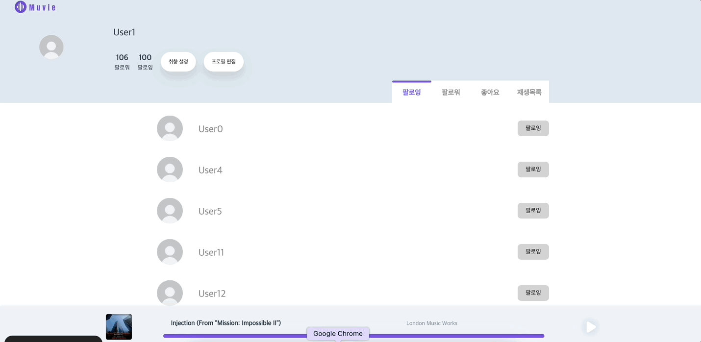
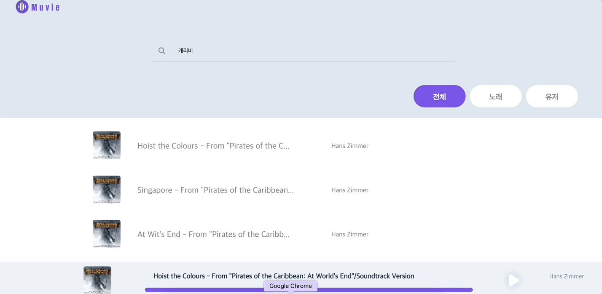

<h1 align="center">🎵 Muvie 🎬</h1>
 

DRF(Django REST Framework) & Vue.js로 구현한 Restful 웹 프로젝트

<a>Muvie</a>는 영화 OST를 스트리밍할 수 있고, 다른 사용자와의 상호작용을 통해 자신의 취향에 알맞는 음악을 추천받을 수 있는 서비스입니다.

 

## Tech Stack

### Back-end & Front-end

### Collaboration Tools

 

## ✔ 목차

### ✔︎ 소개
  - [X] 팀 소개
  - [X] 프로젝트
### ✔︎ 서비스
  - [X] 회원 상호작용
  - [X] 음악 관련 기능
  - [X] 추천 알고리즘
### ✔︎ 관련 문서
  - [X] 기획
    - [X] 요구사항 정의서
    - [X] 디자인
    - [X] ERD
  - [X] 개발
    - [X] API 문서

### ✔︎ 팀 규칙 / 문화
  - [X] Commit Convention
  - [X] Git Flow
  - [X] Team Rule & Culture

### ✔︎ 회고
  - [X] 개발일지
    - [X] [@정예륜](https://github.com/YeryunJung)의 개발일지
    - [X] [@이명우](https://github.com/Fishphobiagg)의 개발일지

 
<h1 align="center">✔ 소개</h1>

## 👩‍💻 TEAM 🧑‍💻
 

| 정예륜(팀원) | 이명우(PM) |
| --- | --- |
| 
Front-end
 | 
Back-end
 |
| [@YeryunJung](https://github.com/YeryunJung) | [@Fishphobiagg](https://github.com/Fishphobiagg) |
 

#### 👉 [팀원 소개](https://perfect-bluebell-dba.notion.site/Member-2eaf53660b9f47638c0edc7a2e63f147) 👈

 

## 프로젝트
> 내가 좋아하는 영화, 내가 좋아하는 음악 Muvie
> * 내가 듣던 영화 OST를 찾고 싶다면? ***Muvie***
> * 내가 들었던 영화 OST와 비슷한 음악을 찾고 싶다면? ***Muvie***
1. 내 취향에 맞는 영화 OST 추천
2. 나와 비슷한 음악을 찾는 사람도 만나볼 수 있고,
3. 음악 스트리밍, 재생목록, 좋아요로 내 개성을 표현
3. 새로운 음악을 추천해주는 기능까지

 

 

 
<h1 align="center">🚀 서비스
 

Muvie 기능 소개 + 핵심 알고리즘에 대한 설명

</h2>

### 1️⃣ 회원 상호작용

#### 팔로우/언팔로우/프로필 조회

> 유저 간 팔로우 및 언팔로우가 가능합니다. 또 유저 프로필 조회를 통해 상대방의 팔로워, 팔로잉, 좋아요 목록, 플레이리스트까지 확인할 수 있습니다.

 

 

### 2️⃣ 음악 관련 기능
#### 좋아요/스트리밍/플레이리스트

> 자신이 좋아하는 음악에 대한 좋아요 기능을 이용할 수 있습니다. 또한 음악을 스트리밍 할 수 있으며 플레이리스트에 추가해둘 수도 있습니다.

 

 

### 3️⃣ 추천 알고리즘
사용자 입력 취향 노래 기반 추천/유사 사용자 추천/최근 이용 동향 기반 추천

> 메인 페이지에서 이용자의 취향 및 행동에 따른 노래를 추천받을 수 있습니다. 추천 알고리즘은 총 세 가지입니다.

👉 [추천 알고리즘 상세 설명](https://www.notion.so/Recommendation-algorithms-aca53ba69dac448292604dc6aff46721?pvs=4) 👈

 

## 관련 문서
 

### ✒ 기획 

#### [ERD](https://github.com/Fishphobiagg/Muvie/wiki/ERD)
#### [요구사항 정의서](https://perfect-bluebell-dba.notion.site/1e54ff56a7a34de8b57aca5876a0b84b)
#### [디자인](https://www.figma.com/file/oWZhVQ82Wh3Met5o5I9w2b/230501_MUVIE?type=design&node-id=0%3A1&t=mxH7VMSR9IYFajhf-1)

### 🛠 개발

#### [API문서](https://perfect-bluebell-dba.notion.site/API-guide-02deb57303b2493b9cdf224d3604fac8)

## 팀 규칙 / 문화

### Commit Convention

  | Type 키워드 | 사용 시점 |
| --- | --- |
| feat | 새로운 기능 추가 |
| fix | 버그 수정 |
| docs | 문서 수정 |
| style | 코드 스타일 변경 (코드 포매팅, 세미콜론 누락 등)기능 수정이 없는 경우 |
| refactor | 코드 리팩토링 |
| chore | 빌드 업무 수정, 패키지 매니저 수정 (gitignore 수정 등) |
 

### git flow

| 브랜치명 | 구분 | 설명 | 비고 |
| --- | --- | --- | --- |
| master | 유지 브랜치 | - 기본 브랜치 - 언제든지 배포 가능한 형태 유지 |  |
| dev | 보조 브랜치 | - feature가 모이는 통합 |
| feature | 보조 브랜치 | - 기능 단위 개발 브랜치| ex) feat: signup  |
| hotfix | 보조 브랜치 | - 운영중 긴급한 오류를 해결하기 위한 브랜치 |  |

### Team Rule & Culture

* 어떤 사항이든 2인 합의하에 진행
* PR / issue 작성시 템플릿 준수
* 브랜치 전략 유연하게 활용
* 문제 발생 -> 해결 -> 개발일지 작성
* 사과 금지 자책 금지
  
 

<h2 align="center">📝개발일지
 
</h2>

 

* 📕 [개발일지(정예륜)](https://perfect-bluebell-dba.notion.site/2961c75bb5af47a4a35a6ce27cf8e6ec)
* 📘 [개발일지(이명우)](https://perfect-bluebell-dba.notion.site/9fc715b299ee4870b366511b6d56ef95)

 
